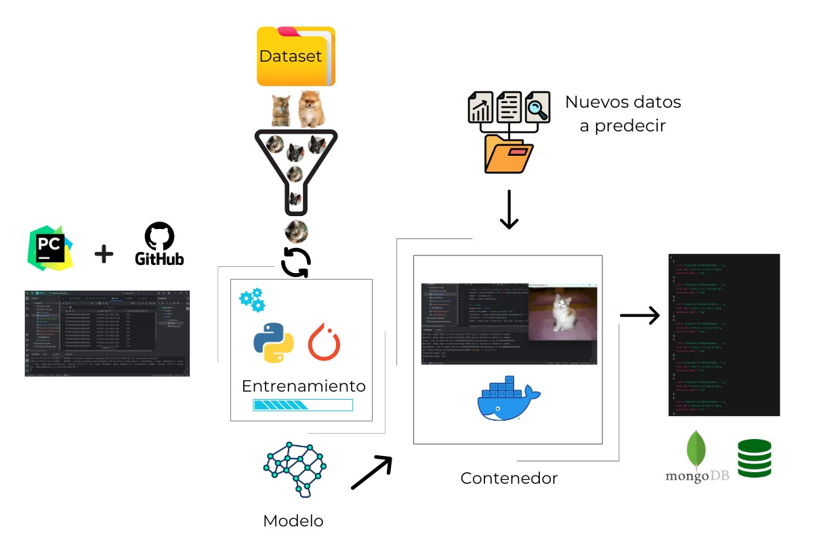
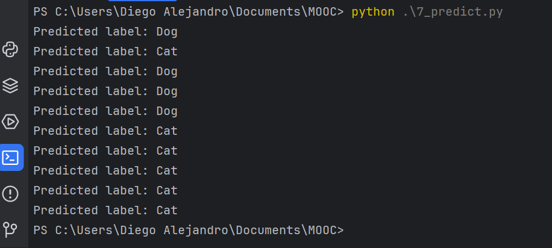
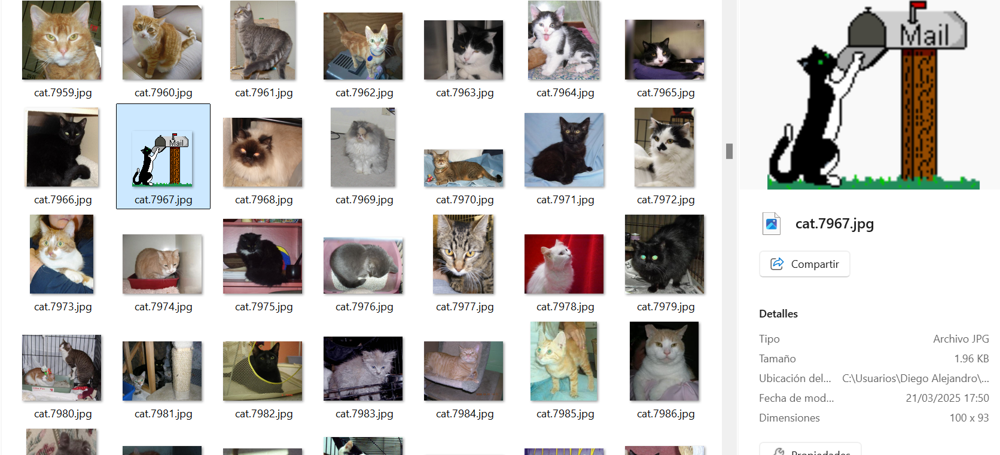
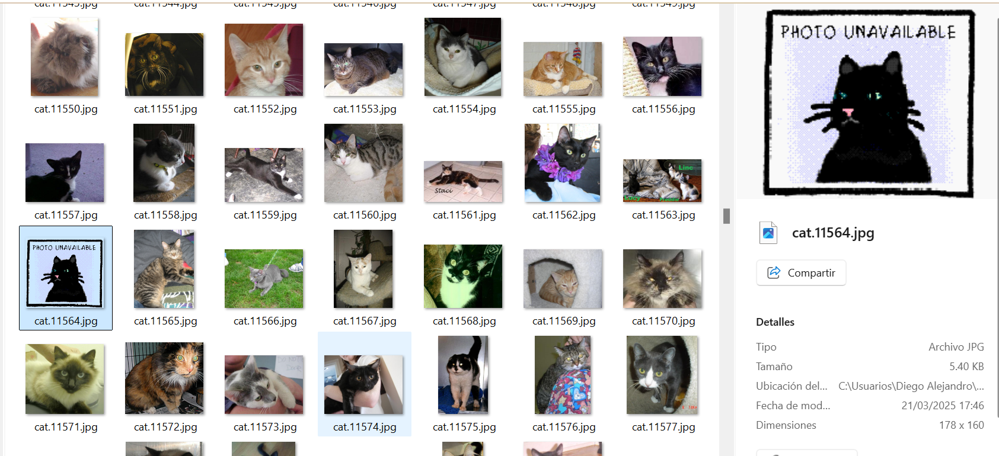
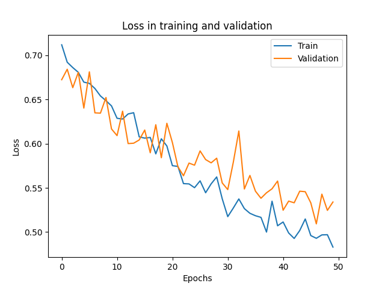
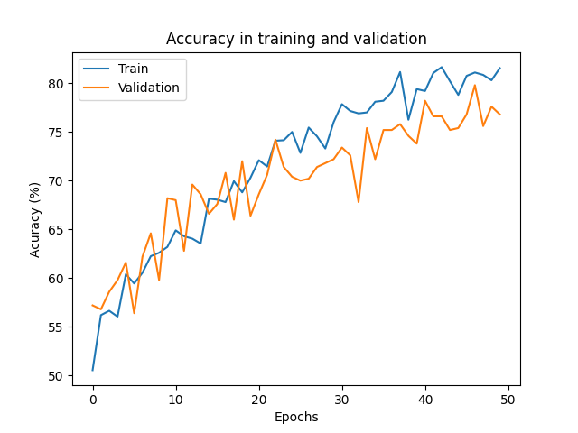

# 🐱🐶 Clasificación de Imágenes: Gatos y Perros con PyTorch

## 📌 Descripción del Proyecto

Este proyecto tiene como objetivo construir un modelo de clasificación de imágenes capaz de distinguir entre gatos y perros utilizando redes neuronales convolucionales (CNN) con PyTorch.

    

Descarga del dataset desde Kaggle:  
📦 **[Dog and Cat Classification Dataset – Kaggle](https://www.kaggle.com/datasets/bhavikjikadara/dog-and-cat-classification-dataset/data)**

---

## ⚙️ Herramientas Utilizadas

Se emplearon múltiples herramientas para lograr una implementación sólida, flexible y eficiente:

- **Python** como lenguaje principal de desarrollo.  
- **PyTorch** para la definición y entrenamiento de la red neuronal.  
- **OpenCV** y **Matplotlib** para lectura y visualización de imágenes.  
- **Scikit-learn** para métricas de evaluación y reporte de clasificación.  
- **NumPy** y **Pandas** para manipulación de datos.  
- **TQDM** para seguimiento visual del entrenamiento.  
- **MongoDB** como base de datos para almacenar resultados.  
- **GitLab** para control de versiones.  
- **Docker** para la encapsulación en un contenedor.  
- **PyCharm** como entorno de desarrollo.  

---

## 🧠 Entrenamiento del Modelo

El modelo fue entrenado utilizando un conjunto de **24,998 imágenes**, previamente renombradas y organizadas. Durante el proceso se manejaron errores como imágenes corruptas, implementando validaciones dentro del `Dataset`.

Se experimentó con diferentes números de épocas para observar cómo la red iba aprendiendo progresivamente.

### 📌 Dato importante:
Durante el desarrollo, se comprobó que **la calidad del dato** (presencia de imágenes borrosas, mal etiquetadas o corruptas) y **la cantidad disponible de muestras** son factores **cruciales en la evolución del aprendizaje** y en la capacidad del modelo para **generalizar correctamente**.

---

## 📈 Estrategia de Entrenamiento

- Red neuronal convolucional personalizada.  
- Validación con `train_test_split`.  
- Métricas clave: **accuracy** y **loss** por época.  
- Visualización de evolución del aprendizaje.  
- Análisis de **predicciones correctas vs incorrectas**.  

---

## 🖼️ Visualizaciones del Proceso

### 📸 Predicciones Correctas  
_(ejemplos de imágenes clasificadas correctamente con la probabilidad del modelo)_

    
    
    

    
    

---

### ❌ Predicciones Incorrectas  
_(Ejemplos donde el modelo falló y posibles razones del error)_

    
    
    
    

---

### 🧪 Modelos Entrenados y Comparativas  
_(Gráficos que muestren la evolución del modelo según el número de épocas)_

    
    
    

    

---

## ✅ Observaciones Finales

- El modelo mejora su precisión significativamente a partir de la **10.ª época**.  
- Se comprobó que **la calidad y cantidad del dataset influyen directamente** en la capacidad de generalización del modelo.  
- El código incluye **manejo de errores**, control de imágenes corruptas y **visualizaciones automáticas** del entrenamiento.  
- La estructura modular del proyecto permite **escalar fácilmente** a nuevas clases o datasets más grandes.

---

## 🚀 Próximos Pasos

- Implementar técnicas de **data augmentation** para mejorar la generalización.  
- Ajuste de hiperparámetros mediante **Grid Search** o similares.  
- Exportación del modelo a formatos compatibles con **aplicaciones móviles/web**.
